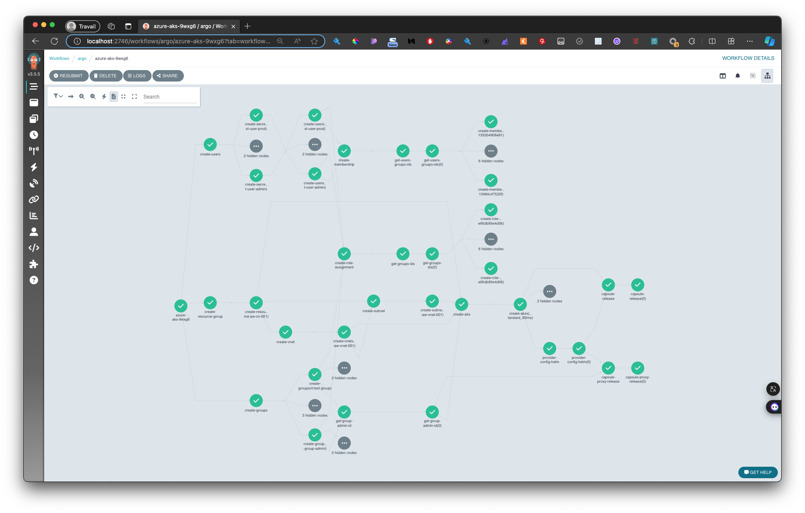

# Cloud Native Architecture

This repo is the resources for the blog post : https://blog.alterway.fr

## Proof of Concept

Main Goal: Deploy a multi-tenant oriented kubernetes cluster based on Clastix/Capsule in cloud native mode.

Tools Used: 
- **Crossplane**: Crossplane is a cloud-native control plane framework for managing infrastructure and applications across multiple cloud providers.
- **Argo Workflow**: Argo Workflow is a Kubernetes-native workflow engine for orchestrating parallel jobs and complex, multi-step tasks.
- **Clastix/Capsule**: Capsule is a Kubernetes operator that enables multi-tenancy and namespace-as-a-service capabilities in Kubernetes clusters.
- **kluctl** : Kluctl is a GitOps-focused deployment tool for Kubernetes that emphasizes simplicity and declarative configurations.

<pre><code> Workflow                      ┌─────────────────────────────────────────┐     
│                              │                                         │    │
                               │                                         │     
│               ┌───────┐  ┌───────┐           ┌───────┐ ┌───────┐       │    │
                │ user  │  │ admin │           │reader │ │  aks  │       │     
│               └───────┘  └───────┘           └───────┘ └───────┘       │    │
                    │          │                  │          │           │     
│                   │          │                  │          │           │    │
                    │          │                  └───┬──────┘           │     
│                   │          │                      │                  │    │
                    │          │                      │                  │     
│ ┌──────────┐      │    ┌──────────┐           ┌──────────┐             │    │
  │          │      │    │          │           │   Role   │             │     
│ │  Users   │      └────│  Groups  │───────────│Assignment│             │    │
  │          │           │          │           │          │             │     
│ └──────────┘           └──────────┘           └──────────┘             │    │
        │                      │                                         │     
│       │                      │                                         │    │
        │                      │                                         │     
│       │                      │                                         │    │
        │     ┌──────────┐     │                                         │     
│       │     │  Group   │     │                                         │    │
        └─────│  Member  │─────┘                                         │     
│             │          │                                               │    │
              └──────────┘                                               │     
│                                                                        │    │
                                                                         │     
│                                                                        │    │
                                                                         │     
│                                                                        │    │
      ┌──────────┐      ┌──────────┐      ┌──────────┐     ┌──────────┐  │     
│     │ Resource │      │          │      │          │     │          │  │    │
      │  Group   ├──────┤   Vnet   │──────│  Subnet  │─────│   AKS    │──┘     
│     │          │      │          │      │          │     │          │       │
      └──────────┘      └──────────┘      └──────────┘     └──────────┘        
│                                                                │            │
                                                                 │             
│                                                                │            │
                        ┌───────────────────────┬────────────────┘             
│                       │                       │                             │
                        │                       │                              
│                       │                       │                             │
                        │  ┌─────────┐  ┌──────────────┐     ┌─────────┐       
│                       └──│ Capsule │  │Capsule-Proxy │─────│   LB    │      │
                           └─────────┘  └──────────────┘     └─────────┘       
│                               │                                             │
                         ┌──────┴────────┬───────────────┐                     
│                        │               │               │                    │
                  ┌─────────────┐ ┌─────────────┐ ┌─────────────┐              
│                 │ dev tenant  │ │ prod tenant │ │ ... tenant  │             │
                  └─────────────┘ └─────────────┘ └─────────────┘              
│                                                                             │
                                                                               
│                                                                             │
 ─ ─ ─ ─ ─ ─ ─ ─ ─ ─ ─ ─ ─ ─ ─ ─ ─ ─ ─ ─ ─ ─ ─ ─ ─ ─ ─ ─ ─ ─ ─ ─ ─ ─ ─ ─ ─ ─ ─ </code></pre>

Tasks: 

- Create Microsoft Entra resources to activate Azure Entra Authentification on kubernetes
  - Users
  - Groups
  - Role Assignment
  - Group members
- Create Microsoft resources
  - Resource Group
  - Virtual Network
  - Subnets
  - AKS cluster 
- Deploy kubernetes resources et helm charts
  - namespaces
  - helm chart capsule and capsule-proxy




## How to use it 


Pre-requisites

- CLI :
  - kubectl 😉
  - kluctl (https://kluctl.io/blog/)
  - crossplane (https://docs.crossplane.io/v1.16/)
  - argo workflow (https://argo-workflows.readthedocs.io/en/latest/)
  
- A kubernetes Management cluster (kind, aks, ...)
- An Azure subscription and Entra rights

For crossplane 

If you want to do it by your own

- Installation : https://docs.crossplane.io/v1.16/software/install/
- To use with Azure : https://docs.crossplane.io/latest/getting-started/provider-azure/


If you want to do it with this repository: 

Go to crossplane directory

Just put in `creds` a file named `azure-credentials.json`.

Documentation here to know how generate it (Create a Kubernetes secret for Azure) : (https://docs.crossplane.io/latest/getting-started/provider-azure/)

Then simply use :

```bash
kluctl deploy -t poc --prune --yes
```

## What you have to change / edit

The values in `the-workflow.yaml` file 


## How to create workflow templates

in argo directory : 

```bash
kluctl deploy -t aw --prune --yes
```


## Deploy the Workflow

```bash
kubectl create -f the-workflow.yaml

❯ kubectl get workflow
NAME              STATUS    AGE   MESSAGE
azure-aks-p9h2k   Running   68s   
```

If all goes well to will have a ready to use AKS with AD authentication and Capsule.


## How to check that all is working 😃


### kubeconfig admin

Change resource group and aks name 

```bash
az aks get-credentials --resource-group aw-cn-001 --name aw-aks-001 -a  -f aw-aks-001-admin.conf
```

### Check that we can bypass AD auth with `admin`kubeconfig


```bash

# nodes
KUBECONFIG=aw-aks-001-admin.conf  kubectl get nodes

NAME                              STATUS   ROLES    AGE     VERSION
aks-default-11531118-vmss000000   Ready    <none>   9m22s   v1.29.4

# namespaces
❯ KUBECONFIG=aw-aks-001-admin.conf  kubectl get ns
NAME              STATUS   AGE
capsule-system    Active   11m
default           Active   14m
kube-node-lease   Active   14m
kube-public       Active   14m

# pods 

❯ KUBECONFIG=aw-aks-001-admin.conf  kubectl get po -n capsule-system
NAME                                         READY   STATUS    RESTARTS      AGE
capsule-controller-manager-5b577784f-w7gmb   1/1     Running   0             11m
capsule-proxy-5dd6c46575-nk4sd               1/1     Running   1 (11m ago)   11m


# Services look at Loadbalancer !

❯ KUBECONFIG=aw-aks-001-admin.conf  kubectl get svc -n capsule-system
NAME                                         TYPE           CLUSTER-IP       EXTERNAL-IP      PORT(S)         AGE
capsule-controller-manager-metrics-service   ClusterIP      100.64.205.63    <none>           8080/TCP        12m
capsule-proxy                                LoadBalancer   100.64.144.96    135.236.172.56   443:32198/TCP   12m
capsule-proxy-metrics-service                ClusterIP      100.64.202.229   <none>           8080/TCP        12m
capsule-webhook-service                      ClusterIP      100.64.68.70     <none>           443/TCP         12m


# tenants

❯ KUBECONFIG=aw-aks-001-admin.conf  kubectl get tenants
NAME      STATE    NAMESPACE QUOTA   NAMESPACE COUNT   NODE SELECTOR   AGE
dev       Active                     0                                 27m
prod      Active                     0                                 27m
staging   Active                     0                                 27m

```


### Get User's kubeconfig

```bash
kubectl view-secret -n crossplane-system aw-aks-001-connection kubeconfig  > aw-aks-001.conf
```

### Use it  

```bash
KUBECONFIG=aw-aks-001.conf  kubectl get ns  


To sign in, use a web browser to open the page https://microsoft.com/devicelogin and enter the code D9CC9JUSC to authenticate.

# Use dev user 

eg. : test-user-dev@microsoftalterway.onmicrosoft.com / ##=p4ssw0rd=##


Error from server (Forbidden): namespaces is forbidden: User "test-user-dev@microsoftalterway.onmicrosoft.com" cannot list resource "namespaces" in API group "" at the cluster scope: User does not have access to the resource in Azure. Update role assignment to allow access.

```

This is not a fail !

Try this :
You must prefix the namespace name with the tenant name the test-user-dev belongs


dev user can create a namespace into its tenant dev if its name begin by the name of the tenant

```bash

❯ KUBECONFIG=aw-aks-001.conf  kubectl create ns test
Error from server (Forbidden): admission webhook "namespaces.projectcapsule.dev" denied the request: The namespace doesn't match the tenant prefix, expected dev-test


### Working ns creation

KUBECONFIG=aw-aks-001.conf  kubectl create ns dev-demo 
namespace/dev-demo created

```

### Use your tenant

```bash
❯ KUBECONFIG=aw-aks-001.conf  kubectl run -ti --rm -n dev-demo  --image alpine -- sh

If you don't see a command prompt, try pressing enter.
/ #

```


## Tricks

### Clean

Attention --all !

```

kubectl delete tenants --all

kubectl delete releases.helm.crossplane.io  --all
kubectl delete kubernetesclusters.containerservice.azure.upbound.io --all
kubectl delete subnet --all
kubectl delete virtualnetwork --all
kubectl delete resourcegroup --all

kubectl delete members.groups.azuread.upbound.io --all
kubectl delete roleassignments.authorization.azure.upbound.io --all

kubectl delete users --all
kubectl delete groups --all


```

### Get Argo Workflow API Token

kubectl -n argo exec argo-workflows-server-XXXXXXXX -- argo auth token